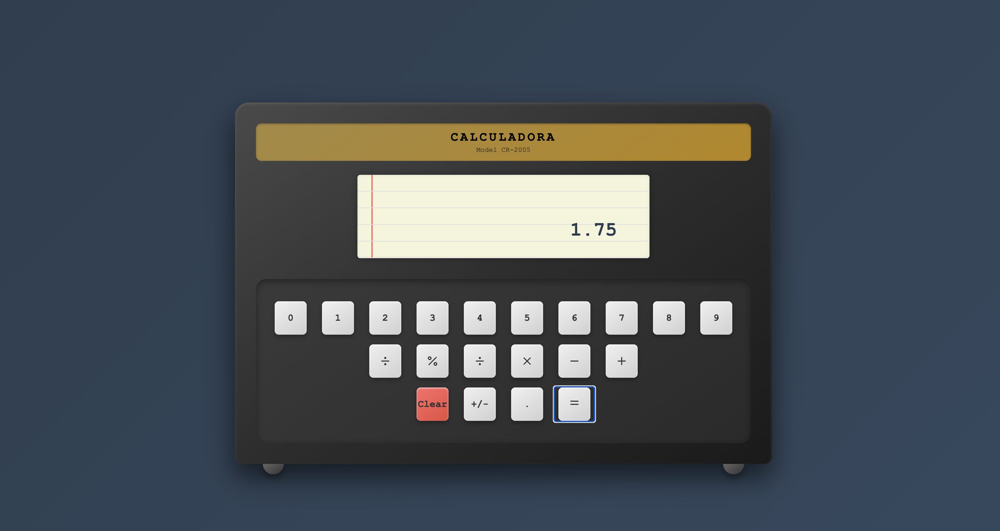

# Calculadora React

Este proyecto es una calculadora desarrollada con React y Vite.

## Requisitos

- Node.js >= 18
- npm >= 9

## Imagen



## Pasos para clonar y correr el proyecto

```bash
# 1. Clonar el repositorio
git clone https://github.com/CamiR24/Proyecto1-web.git

# 2. Entrar a la carpeta del proyecto
cd Proyecto1-web

# 3. Instalar las dependencias
npm install

# 4. Iniciar el servidor de desarrollo
npm run dev